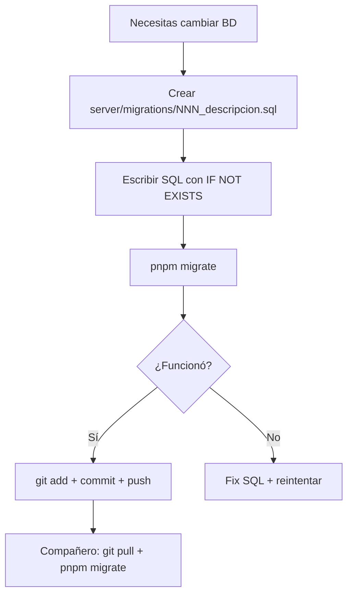

# Database Migrations Workflow

**Última actualización:** 2026-08-18

## Resumen

Este proyecto usa un sistema de migraciones simple basado en archivos SQL numerados. Cada cambio en la base de datos se hace creando un archivo en `server/migrations/`, no editando `schema.sql` directamente.

---

## Archivos clave

| Archivo | Propósito |
|---------|-----------|
| `server/migrations/001_create_units.sql` | Migración inicial (ejemplo) |
| `server/migrate.ts` | Runner que aplica migraciones pendientes |
| `package.json` | Script `pnpm migrate` |
| Tabla `_migrations` | Rastrea qué migraciones ya se aplicaron |

---

## Cuándo crear una migración

**Siempre que cambies el esquema de la BD:**
- Nueva tabla
- Nueva columna
- Índice nuevo
- Foreign key
- Cambio de tipo de columna
- Default/constraint nuevo

**NO cuando:**
- Solo cambias lógica de la API (sin tocar tablas)
- Solo cambias frontend
- Datos de seed (usa `server/seed.ts` si existe)

---

## Cómo crear una migración

### 1. Crear el archivo SQL

```bash
# Siguiente número secuencial: 002, 003, etc.
touch server/migrations/002_descripcion_corta.sql
```

**Convención de nombres:** `NNN_descripcion_en_snake_case.sql`

Ejemplos:
- `002_add_email_to_users.sql`
- `003_create_product_categories.sql`
- `004_add_index_on_movements_branch.sql`

### 2. Escribir el SQL

```sql
-- server/migrations/002_add_email_to_users.sql
-- Descripción: Agregar columna email a users para notificaciones

alter table users add column if not exists email_notifications boolean not null default true;

create index if not exists idx_users_email_notifications on users(email_notifications);
```

**Reglas:**
- Un `statement` por archivo (o varios que vayan juntos atómicamente)
- Usa `if not exists` / `if exists` para idempotencia
- No uses `begin`/`commit` — el runner lo hace por ti

### 3. Ejecutar localmente

```bash
pnpm migrate
```

Deberías ver:
```
▶ 002_add_email_to_users.sql
✓ 002_add_email_to_users.sql
Migraciones completadas
```

### 4. Commit y push

```bash
git add server/migrations/002_add_email_to_users.sql
git commit -m "db: add email_notifications column to users"
git push
```

---

## Cómo aplica tu compañero

```bash
git pull
pnpm migrate
```

El runner:
1. Lee `_migrations` table
2. Compara con archivos en `server/migrations/`
3. Ejecuta **solo** los que falten (por número)
4. Los registra en `_migrations`

---

## Flujo completo (cheatsheet)



---

## Verificar estado

```bash
# Ver migraciones aplicadas
psql $DATABASE_URL -c "select * from _migrations;"

# Ver esquema actual
psql $DATABASE_URL -c "\d units"
```

---

## Errores comunes

| Error | Solución |
|-------|----------|
| `relation "X" already exists` | Ya existe en BD → marca como aplicada: `insert into _migrations (name) values ('NNN_x.sql') on conflict do nothing;` |
| `syntax error` | SQL inválido → corrige el archivo y re-ejecuta `pnpm migrate` |
| `foreign key constraint fails` | Orden incorrecto → crea la tabla referenciada primero (número menor) |

---

## Referencia: schema.sql vs migraciones

| | `schema.sql` | Migraciones |
|---|--------------|-------------|
| Uso | **Fresh install** (DB nueva) | **Incremental** (DB existente) |
| Cuándo | `createdb x && psql -f schema.sql` | Cada cambio en desarrollo |
| Contiene | TODO el esquema | Solo lo NUEVO desde la última |
| Se edita | Ocasionalmente (re-sync) | Siempre (cada PR con cambio BD) |

### Flujo típico

1. **Nuevo dev / CI / staging**: corre `schema.sql` una vez → BD lista con todo
2. **Desarrollo diario**: crea `002_add_x.sql` → `pnpm migrate` → commit
3. **Re-sync ocasional**: cuando `schema.sql` divergió mucho, lo regeneras desde una BD real (pg_dump --schema-only) o editas manualmente, **pero no rompas el historial de migraciones**

---

## Para la IA (próxima sesión)

> **Si el usuario pide "agregar columna X a tabla Y":**
> 1. Crear `server/migrations/NNN_add_x_to_y.sql`
> 2. SQL: `alter table y add column if not exists x tipo;`
> 3. `pnpm migrate`
> 4. Commit archivo
>
> **NUNCA edites `schema.sql` para cambios incrementales.**
> **NUNCA le digas al usuario "corre esto en TablePlus".**